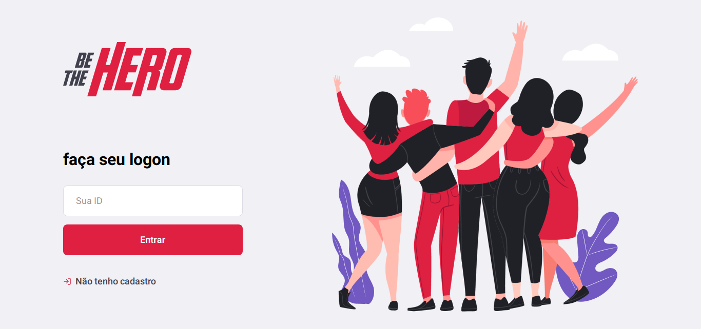
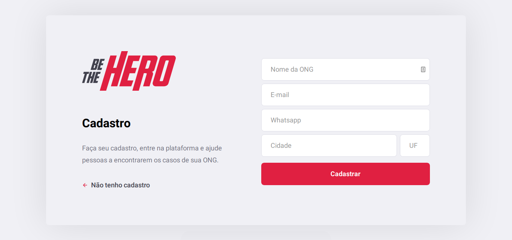
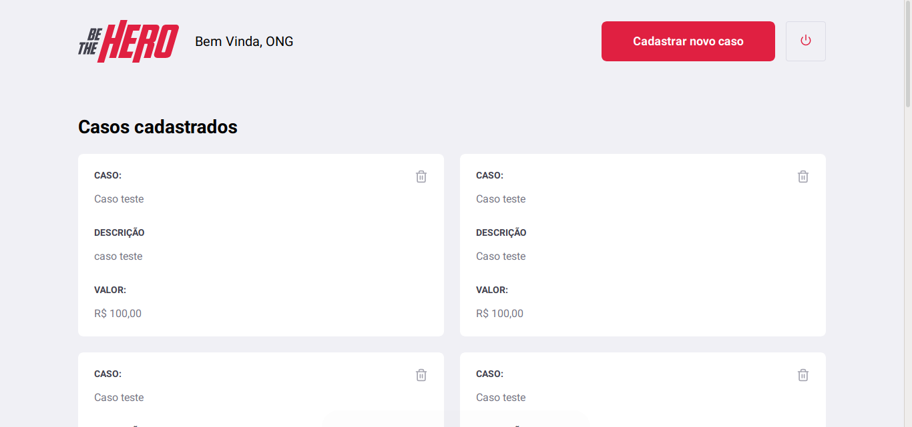

<h1 align="center">


[](https://github.com/mateusfg7/BeTheHero-Backend)
[](https://github.com/mateusfg7/BeTheHero-Frontend)
[](https://github.com/mateusfg7/BeTheHero-Mobile)

_Front-end da aplicação 'Be The Hero', feita na Semana OmniStack 11 da [Rocketseat](https://rocketseat.com.br/)_
_(23/03/20 a 27/03/20)_

</h1>

<h3 align="center">

Be The Hero (Seja um herói) é uma aplicação que conecta pessoas que tem vontade de ajudar ONGS doando um valor para tratar algum caso específico.

</h3>

> Template figma (.fig) do projeto -> [doc/Be_The_Hero_OmniStack_11.fig](doc/Be_The_Hero_OmniStack_11.fig)

---

<h3 align="center">

**App feito com [React JS](https://reactjs.org/)**

[](https://rocketseat.com.br/)

</h3>

## Iniciar aplicação
```bash
npm start
```

## Deploy
```bash
npm build
```

## Estrutura

- `App.js` -> Arquivo principal

- `src/assets/` -> imagens

- `src/pages/` -> páginas do projeto

- `src/services/api.js` -> chamada a api do back-end.
Adicione o endereço do servidor back-end da aplicação à [linha 4](https://github.com/mateusfg7/BeTheHero-Frontend/blob/master/src/services/api.js#L4) (`baseURL: '',`)
```javascript
import axios from 'axios';

const api = axios.create({
  baseURL: 'AQUI_VAI_O_ENDEREÇO_DO_SERVIDOR',
});

export default api;
```
_ex:_
```javascript
import axios from 'axios';

const api = axios.create({
  baseURL: 'http://127.0.0.1:3333',
});

export default api;
```

- `routes.js` -> arquivo de rotas da aplicação
- `src/pages/Logon/` -> página de logon
- `src/pages/NewIncident` -> página de cadastro de um novo caso
- `src/pages/Profile` -> página de listagem de casos
- `src/pages/` -> página de registro de um novo caso


<h3 align="center">

## Screenshots
> _página de logon_


> _página de cadastro de uma ONG_


> _página de listagem dos casos_


> _página de caastro de um novo caso_


<h3>

