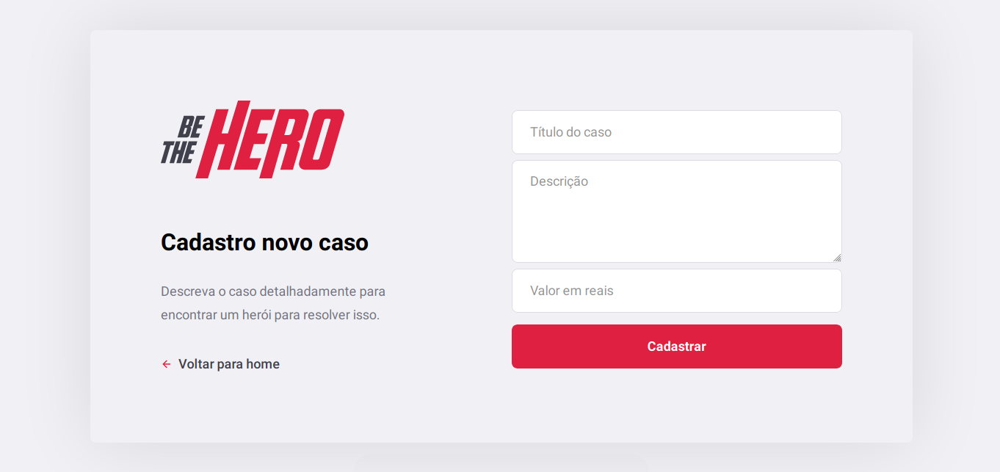

<h1 align="center">


[](https://github.com/mateusfg7/BeTheHero-Backend)
[](https://github.com/mateusfg7/BeTheHero-Frontend)
[](https://github.com/mateusfg7/BeTheHero-Mobile)

</h1>

<h3 align="center">

_Front-end da aplicação 'Be The Hero', feita na Semana OmniStack 11 da [Rocketseat](https://rocketseat.com.br/)_

</h3>

---

## Iniciar aplicação
```bash
npm start
```

## Deploy
```bash
npm build
```

Gerado com o comando `create-react-app`

<h3 align="center">

## Screenshots




<h3>

